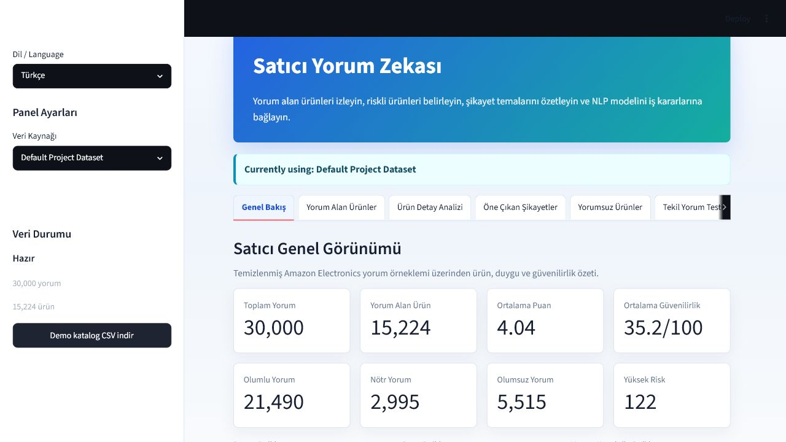
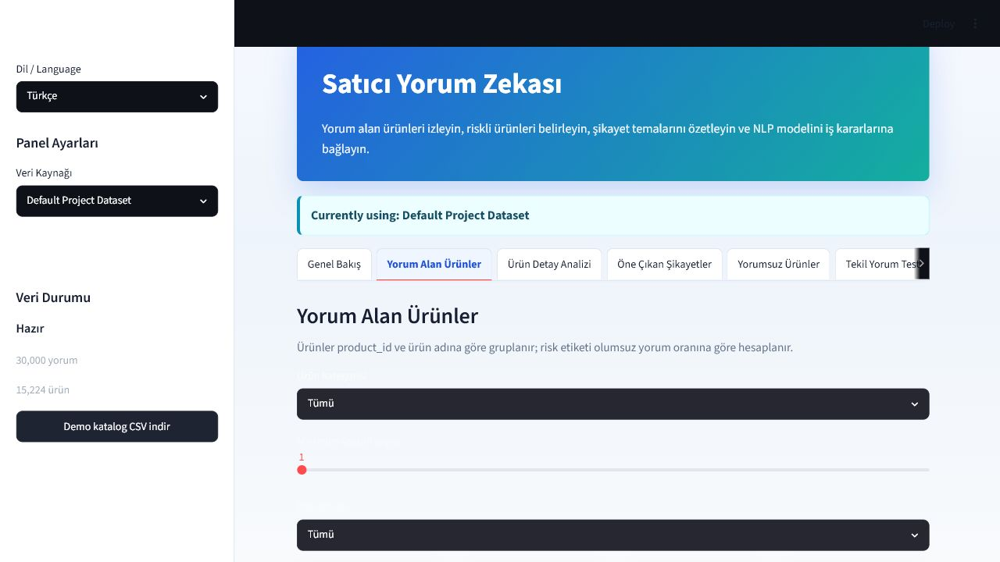
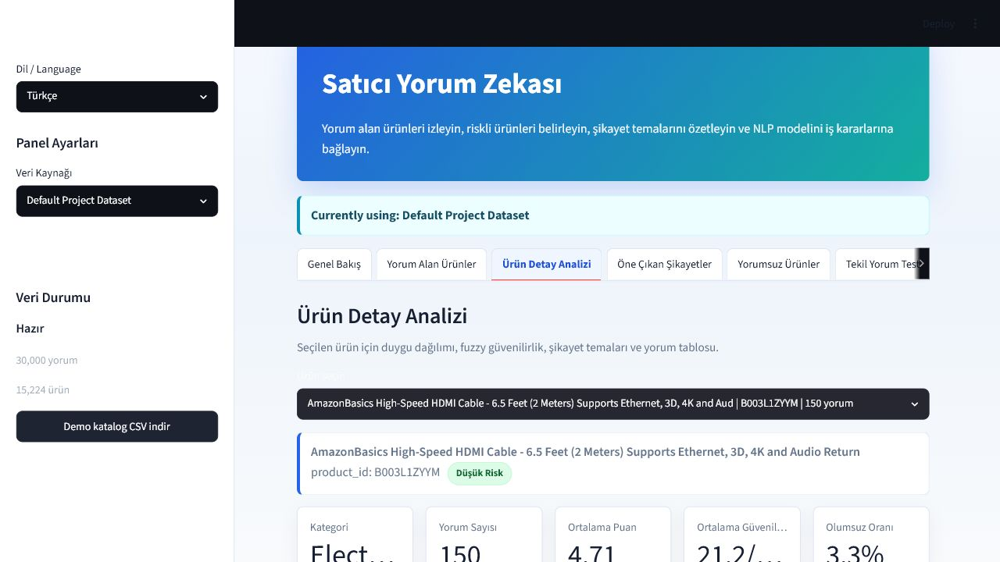
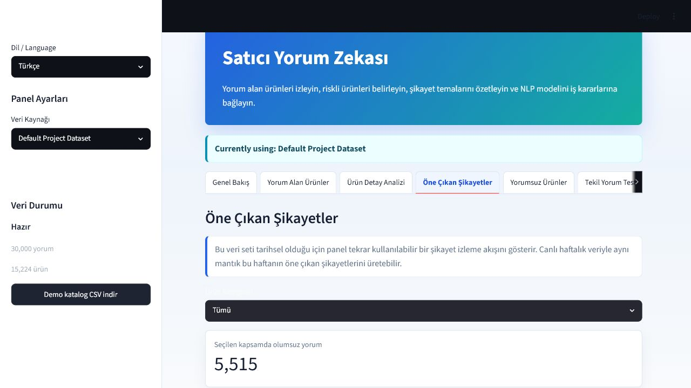
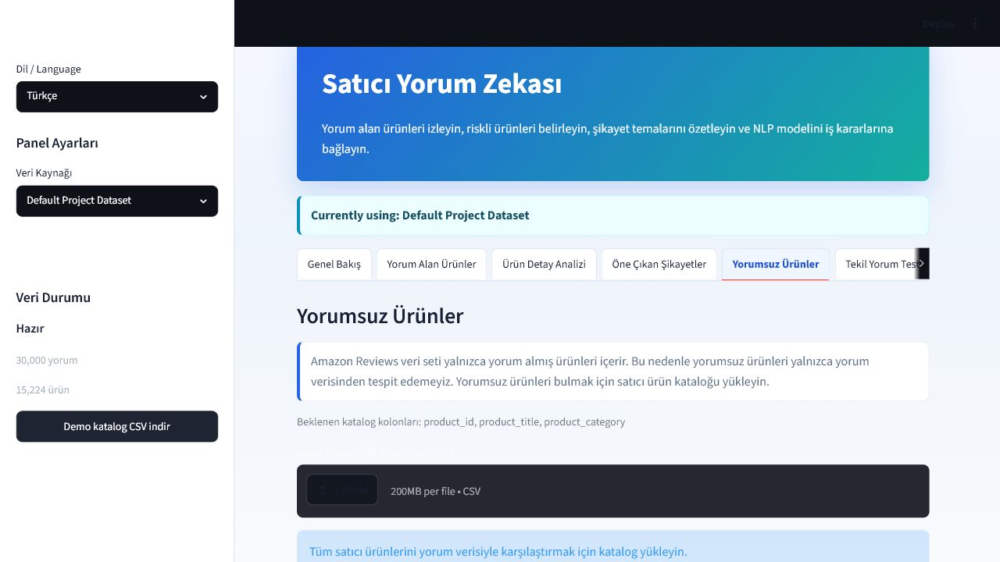
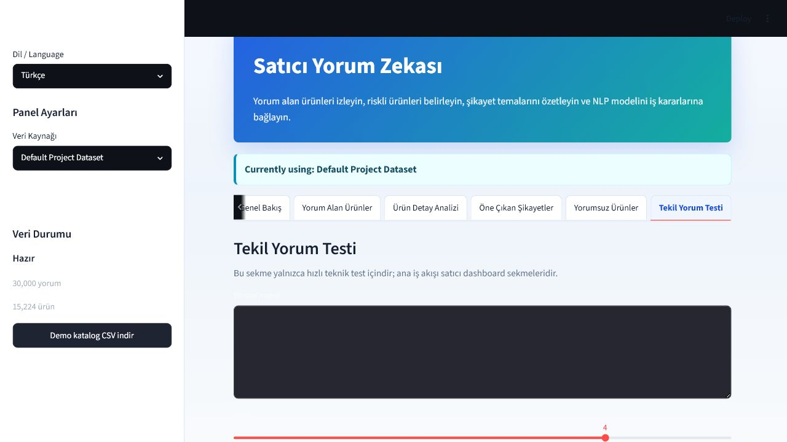

# Customer Review Analysis System

Piton Technology teknik case'i icin hazirlanmis, NLP ve fuzzy logic kullanan satici odakli musteri yorum analizi projesidir.

Bu proje yalnizca tek bir yorum tahmin eden basit bir demo degildir. Ana ekran, bir e-ticaret saticisinin yorum almis urunlerini izlemesi, riskli urunleri belirlemesi, sikayet konularini ozetlemesi ve yorum guvenilirligini fuzzy logic ile yorumlamasi icin tasarlanmis bir Streamlit dashboard'dur.

## Icindekiler

- [Proje Amaci](#proje-amaci)
- [Canli Uygulama Mantigi](#canli-uygulama-mantigi)
- [Ekran Goruntuleri](#ekran-goruntuleri)
- [Teknik Ozellikler](#teknik-ozellikler)
- [Dosya Yapisi](#dosya-yapisi)
- [Kurulum](#kurulum)
- [Dataset Hazirlama](#dataset-hazirlama)
- [Model Egitimi ve Rapor Uretimi](#model-egitimi-ve-rapor-uretimi)
- [Streamlit Dashboard Kullanimi](#streamlit-dashboard-kullanimi)
- [Veri Kaynagi Secimi](#veri-kaynagi-secimi)
- [Moduller Ne Ise Yarar](#moduller-ne-ise-yarar)
- [Teknik Kararlar](#teknik-kararlar)
- [Testler](#testler)
- [GitHub Teslim Notlari](#github-teslim-notlari)
- [Video Demo](#video-demo)

## Proje Amaci

Case senaryosunda bir e-ticaret saticisi oldugumuzu dusunuyoruz. Saticinin yuzlerce veya binlerce yorumu tek tek okumasinin yerine sistem su sorulara hizli cevap verir:

- Hangi urunler yorum almis?
- Hangi urunlerde olumsuz yorum orani yuksek?
- Musteriler en cok hangi sikayetleri dile getiriyor?
- Modelin sentiment tahmini ne kadar guvenilir gorunuyor?
- Yorum almamis urunleri gorebilmek icin satici katalogu ile yorum verisi nasil karsilastirilir?

Proje akisi:

1. Kaggle Amazon Reviews Electronics verisi okunur.
2. Temiz ve tekrar uretilebilir 30.000 satirlik orneklem olusturulur.
3. EDA grafikleri uretilir.
4. Yorum metinleri temizlenir ve lemmatization uygulanir.
5. TF-IDF ile Logistic Regression ve Random Forest modelleri egitilir.
6. Logistic Regression modeli GridSearchCV ile optimize edilir.
7. Fuzzy logic ile yorum guvenilirlik skoru hesaplanir.
8. Streamlit dashboard uzerinden urun, sikayet, risk ve test analizleri sunulur.

## Canli Uygulama Mantigi

Streamlit uygulamasi varsayilan olarak su dosyalari kullanir:

```text
data/processed/clean_reviews.csv
outputs/models/best_sentiment_model.joblib
```

Dashboard sekmeleri:

- `Genel Bakis`: Toplam yorum, yorum alan urun sayisi, ortalama puan, sentiment dagilimi ve fuzzy reliability ozeti.
- `Yorum Alan Urunler`: Urun bazli yorum sayisi, pozitif/notr/negatif adetleri, negatif oran ve risk etiketi.
- `Urun Detay Analizi`: Secilen tek urun icin sentiment dagilimi, sikayet temalari, guvenilirlik ve yorum tablosu.
- `One Cikan Sikayetler`: Negatif yorumlardan sik gecen kelime ve bigram cikarimi.
- `Yorumsuz Urunler`: Default veri modunda satici katalogu yuklenirse yorum almayan urunleri bulur; uploaded test veri modunda bos `review_body` satirlarini ayirir.
- `Tekil Yorum Testi`: Egitilmis modeli hizli denemek icin tek yorum girisi.

Risk etiketi kurali:

```text
High Risk   -> negative_ratio >= 0.40 ve review_count >= 5
Medium Risk -> negative_ratio >= 0.20 ve review_count >= 5
Low Risk    -> diger durumlar
```

## Ekran Goruntuleri

### Genel Bakis Dashboard



### Yorum Alan Urunler



### Urun Detay Analizi



### One Cikan Sikayetler



### Yorumsuz Urunler



### Tekil Yorum Testi



## Teknik Ozellikler

Bu repo teknik case beklentilerini su basliklarda karsilar:

- Veri temizleme ve EDA
- Eksik deger analizi
- Rating dagilimi, sentiment dagilimi, yorum uzunlugu ve yorum yasi grafikleri
- Lowercasing, noktalama temizligi, stop word removal ve lemmatization
- TF-IDF tabanli metin temsili
- Pozitif / notr / negatif sentiment siniflandirma
- Logistic Regression ve Random Forest karsilastirmasi
- GridSearchCV ile hiperparametre optimizasyonu
- Accuracy, macro F1, weighted F1, classification report ve confusion matrix
- Misclassification error analysis
- scikit-fuzzy ile fuzzy reliability score
- Model confidence ile fuzzy skorun `weighted_confidence` olarak birlestirilmesi
- Satici odakli Streamlit dashboard
- Turkish / English arayuz secimi
- GitHub Actions CI
- Turkce video demo script

## Dosya Yapisi

```text
piton-review-analysis/
|-- app/
|   `-- streamlit_app.py              # Streamlit satici dashboard'u
|-- data/
|   |-- raw/                          # Kaggle ham TSV dosyasi buraya konur
|   |-- processed/                    # Temizlenmis veri burada uretilecek
|   |-- sample_seller_catalog.csv     # Yorumsuz urun demo katalogu
|   `-- sample_uploaded_test_dataset.csv
|-- docs/
|   `-- screenshots/                  # README icin dashboard ekran goruntuleri
|-- notebooks/
|   `-- 01_eda_modeling_fuzzy.ipynb   # EDA, modelleme ve fuzzy aciklamalari
|-- outputs/
|   |-- figures/                      # EDA ve confusion matrix grafikleri
|   |-- models/                       # Egitilen model dosyalari
|   `-- reports/                      # Model metrikleri ve raporlar
|-- src/
|   |-- data_loader.py                # Ham TSV okuma ve clean_reviews.csv uretimi
|   |-- preprocessing.py              # Metin temizleme ve lemmatization
|   |-- eda.py                        # EDA grafikleri
|   |-- train.py                      # Model egitimi ve GridSearchCV
|   |-- evaluate.py                   # Metrik ve confusion matrix yardimcilari
|   |-- fuzzy_system.py               # Fuzzy reliability score
|   |-- complaint_summary.py          # Negatif yorum sikayet kelimeleri
|   `-- predict.py                    # Tek yorum tahmin yardimcisi
|-- tests/
|   `-- test_preprocessing.py
|-- .github/workflows/python-ci.yml
|-- .gitignore
|-- requirements.txt
|-- README.md
`-- video_script.md
```

## Kurulum

Asagidaki adimlar sifirdan indiren bir kullanicinin projeyi calistirmasi icindir.

### 1. Repoyu indirin

```bash
git clone <GITHUB_REPO_LINKI>
cd piton-review-analysis
```

### 2. Sanal ortam olusturun

Windows:

```bash
python -m venv .venv
.venv\Scripts\activate
```

macOS / Linux:

```bash
python -m venv .venv
source .venv/bin/activate
```

### 3. Kutuphaneleri yukleyin

```bash
pip install -r requirements.txt
```

### 4. NLTK kaynaklarini indirin

```bash
python -m src.preprocessing --download-nltk
```

Bu komut stopword ve lemmatization icin gerekli NLTK kaynaklarini indirir.

## Dataset Hazirlama

Kullanilan veri seti:

```text
Kaggle Amazon US Customer Reviews Dataset - Electronics category
```

Ham veri dosyasi buyuk oldugu icin GitHub'a eklenmez. Dosyayi Kaggle'dan indirip su konuma koyun:

```text
data/raw/amazon_reviews_us_Electronics_v1_00.tsv
```

Kaggle CLI ile indirme ornegi:

```bash
pip install kaggle
kaggle datasets download -d cynthiarempel/amazon-us-customer-reviews-dataset -f amazon_reviews_us_Electronics_v1_00.tsv -p data/raw
tar -xf data/raw/amazon_reviews_us_Electronics_v1_00.tsv.zip -C data/raw
```

Ardindan temizlenmis 30.000 satirlik orneklemi olusturun:

```bash
python -m src.data_loader
```

Bu komut su dosyayi uretir:

```text
data/processed/clean_reviews.csv
```

Temiz veri icinde olusturulan ana kolonlar:

- `review_text`
- `sentiment`
- `review_length`
- `review_age_days`
- `helpful_ratio`
- `product_id`
- `product_title`
- `product_category`

## Model Egitimi ve Rapor Uretimi

Model egitimi:

```bash
python -m src.train
```

Bu komut:

- Logistic Regression modelini egitir.
- Random Forest modelini egitir.
- Modelleri TF-IDF ile calistirir.
- Logistic Regression icin GridSearchCV uygular.
- En iyi modeli kaydeder.
- Metrik raporlarini ve confusion matrix grafiklerini uretir.

Uretilen onemli dosyalar:

```text
outputs/models/best_sentiment_model.joblib
outputs/reports/model_comparison.csv
outputs/reports/optimized_model_metrics.csv
outputs/reports/error_analysis.csv
outputs/figures/confusion_matrix_best_model.png
```

Fuzzy reliability ornek raporu:

```bash
python -m src.fuzzy_system
```

Sikayet kelimeleri raporu:

```bash
python -m src.complaint_summary --top-n 10
```

## Streamlit Dashboard Kullanimi

Uygulamayi baslatmak icin:

```bash
streamlit run app/streamlit_app.py
```

Tarayicida acilacak varsayilan adres:

```text
http://localhost:8501
```

Eger model veya temiz veri dosyasi yoksa uygulama ekranda gerekli komutlari gosterir:

```bash
python -m src.data_loader
python -m src.train
```

## Veri Kaynagi Secimi

Sidebar'da iki veri kaynagi vardir:

### Default Project Dataset

Varsayilan secenektir. Su dosyayi kullanir:

```text
data/processed/clean_reviews.csv
```

Bu mod, Kaggle Electronics yorum orneklemi ile ana dashboard analizini calistirir.

### Uploaded Test Dataset

Kucuk bir satici test CSV dosyasi yuklemek icindir. Bu dosya sadece Streamlit oturumu icinde gecici analiz edilir.

Uploaded test dosyasi:

- `clean_reviews.csv` dosyasini degistirmez.
- Model dosyalarini degistirmez.
- Rapor veya figur dosyalarini overwrite etmez.
- Modeli yeniden egitmez.

Minimum zorunlu kolonlar:

```text
product_id, product_title, product_category
```

Yorum analizi icin onerilen kolonlar:

```text
product_id, product_title, product_category, star_rating,
review_headline, review_body, review_date,
helpful_votes, total_votes, verified_purchase
```

Ornek uploaded test dosyasi:

```text
data/sample_uploaded_test_dataset.csv
```

Bu dosyada `review_body` bos olan satirlar yorumsuz urun olarak ayrilir. Dolu olan satirlar egitilmis NLP modeli ve fuzzy reliability score ile analiz edilir.

## Moduller Ne Ise Yarar

### `src/data_loader.py`

Ham Kaggle TSV dosyasini okur, gerekli kolonlari secer, rating degerlerinden sentiment etiketi uretir ve temiz CSV dosyasini olusturur.

### `src/preprocessing.py`

Yorum metnini kucuk harfe cevirir, noktalama ve fazla bosluklari temizler, stop word temizligi yapar ve lemmatization uygular.

### `src/train.py`

TF-IDF + model pipeline'larini egitir. Logistic Regression ve Random Forest modellerini karsilastirir. GridSearchCV ile en iyi Logistic Regression ayarlarini bulur.

### `src/fuzzy_system.py`

`star_rating`, `review_length` ve `review_age_days` degerlerinden 0-100 arasi fuzzy reliability score uretir.

### `src/complaint_summary.py`

Negatif yorumlardan sik gecen kelime ve bigram'lari cikarir. Kategori ve tarih filtresi destekler.

### `app/streamlit_app.py`

Satici dashboard'unu calistirir. Temiz dataset ve egitilmis modeli yukler, urun bazli risk analizi, sikayet ozeti, yorumsuz urun karsilastirmasi ve tekil yorum testini sunar.

## Teknik Kararlar

### Neden TF-IDF?

Bag-of-Words sadece kelime sayar. TF-IDF ise kelimenin tum veri icindeki ayirt ediciligini de hesaba katar. Musteri yorumlarinda `product`, `good`, `work` gibi genel kelimeler cok tekrar edebilir. TF-IDF bu kelimelerin etkisini azaltip daha ayirt edici terimleri one cikarir.

### Neden Logistic Regression?

TF-IDF ile olusan sparse metin verilerinde Logistic Regression genellikle guclu, hizli ve yorumlanabilir bir baseline modeldir. Bu nedenle Random Forest ile karsilastirilmis ve GridSearchCV ile optimize edilmistir.

### Neden Fuzzy Logic?

Model confidence tek basina yorum kalitesini aciklamaz. Cok kisa, cok eski veya rating/metin uyumu zayif yorumlarda model emin gorunse bile is karari icin daha temkinli olmak gerekebilir. Fuzzy reliability score bu nedenle ek bir is kurali katmani olarak tasarlanmistir.

### Neden Yorumsuz Urunler Icin Katalog Gerekli?

Amazon Reviews dataseti sadece yorum almis urunleri icerir. Bu veri tek basina "hic yorum almamis urunleri" bilemez. Bunun icin saticinin tum urun katalogu gerekir. Dashboard bu katalogu `product_id` uzerinden yorum verisiyle karsilastirir.

## Testler

Testleri calistirmak icin:

```bash
pytest
```

Bu projede mevcut testler metin preprocessing fonksiyonlarini kontrol eder. GitHub Actions workflow'u da push ve pull request durumlarinda testlerin calismasi icin eklenmistir.

## GitHub Teslim Notlari

GitHub'a yuklemeden once kontrol listesi:

- `README.md` dolu ve Markdown formatinda.
- `docs/screenshots/` altinda dashboard ekran goruntuleri var.
- `requirements.txt` mevcut.
- `.gitignore` buyuk veri, sanal ortam ve model ciktilarini repo disinda tutuyor.
- `data/raw/` ve `data/processed/` klasorlerinde `.gitkeep` var; klasor yapisi GitHub'da gorunur.
- Ham Kaggle dataseti GitHub'a yuklenmez; README kurulumda nasil indirilecegini anlatir.
- `.venv/` GitHub'a yuklenmez.
- Video linki hazir olunca README'deki [Video Demo](#video-demo) bolumune eklenir.

Onerilen Git komutlari:

```bash
git init
git add .
git commit -m "Add customer review analysis dashboard"
git branch -M main
git remote add origin <GITHUB_REPO_LINKI>
git push -u origin main
```

Repo public yapildiktan sonra link teslim mailine eklenebilir.

## Video Demo

Video demo icin hazir anlatim metni:

```text
video_script.md
```

Video linki buraya eklenebilir:

```text
TODO: Video demo linki
```
